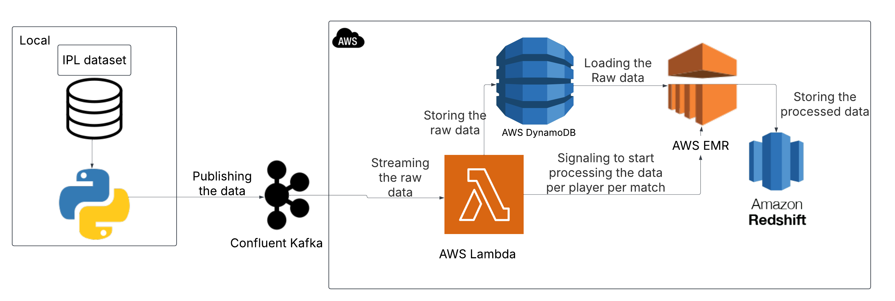

# IPL Streaming Project

## Overview
The **IPL Streaming Project** is a big data application designed to process and stream IPL (Indian Premier League) cricket match data. It leverages **Apache Spark on Amazon EMR** for historical data processing and **AWS Lambda with Confluent Kafka** for real-time streaming of match updates. The project calculates player statistics and fantasy points, storing the results in **Amazon DynamoDB** for further analysis or application use.

## Key Features
- **Historical Data Processing**: Uses **PySpark on EMR** to process IPL match and delivery data.
- **Real-Time Streaming**: Streams live match data using **Kafka** and processes it with **AWS Lambda**.
- **Fantasy Scoring**: Calculates fantasy points based on player performances (e.g., runs, wickets).
- **Scalable Architecture**: Utilizes AWS services for efficient data handling and storage.

## Dataset
The project uses two primary datasets:

1. **matches.csv**: Contains match-level data, including:
   - `id`, `season`, `city`, `date`, `match_type`, `player_of_match`, `venue`, `team1`, `team2`, `toss_winner`, `toss_decision`, `winner`, `result`, `result_margin`, `target`, `over`, `super_over`, `umpire1`, `umpire2`.
   - Sample matches from the **2007/08 season** (e.g., Match ID **335982**: Royal Challengers Bangalore vs. Kolkata Knight Riders).

2. **deliveries.csv**: Contains ball-by-ball data, including:
   - `match_id`, `inning`, `batting_team`, `bowling_team`, `over`, `ball`, `batter`, `bowler`, `non_strike_batsman`, `extra_runs`, `total_runs`, `extras_type`, `is_wicket`, `player_dismissed`, `dismissal_kind`, `fielder`.
   - Sample data from **Match ID 335982**, showing deliveries with details like runs, extras, and wickets.


## Project Architecture 



## Technologies Used
- **Big Data**: Apache Spark (via Amazon EMR) for ETL processing.
- **Cloud Services**: AWS S3 (data storage), AWS Lambda (serverless processing), Amazon DynamoDB (NoSQL database), Amazon Redshift (SQL database).
- **Streaming**: Confluent Kafka for real-time data streaming.
- **Languages**: Python (**PySpark, Lambda functions**).
- **Other Tools**: Git for version control, PEM files for secure access.

## Project Structure
```
├── datasets/                  # IPL dataset files
│   ├── deliveries.csv         # Ball-by-ball data
│   └── matches.csv            # Match-level data
├── EMR_code/                  # Spark ETL scripts
│   └── spark_emr_ipl.py       # PySpark script for historical data processing
├── lambda_code/               # AWS Lambda functions
│   └── lambda_connection.py   # Lambda function for real-time streaming
├── local_publishing/          # Local scripts for data publishing
│   └── publishing_stream.py   # Script to publish data to Kafka
├── architecture_streaming.png # Architecture diagram
├── readme.md                  # Readme file
└── publishing.csv        # Data for publishing to Kafka
```

## Installation and Setup
### Prerequisites
- **AWS account** with access to **EMR, S3, Lambda, DynamoDB, and Kafka**.
- **Confluent Kafka account** or self-hosted Kafka cluster.
- **Python 3.11+** installed locally.

### Setup Instructions
**Deploy and Test**:
- Verify that **Spark ETL jobs** process historical data correctly.
- Ensure **Kafka streams live match data**.
- Check **DynamoDB** for updated streaming ball detail.
- Check **Redshift** for updated player statistics.

---

This project provides a scalable and efficient way to process IPL match data, offering valuable insights into player performances and real-time game statistics. 🚀

